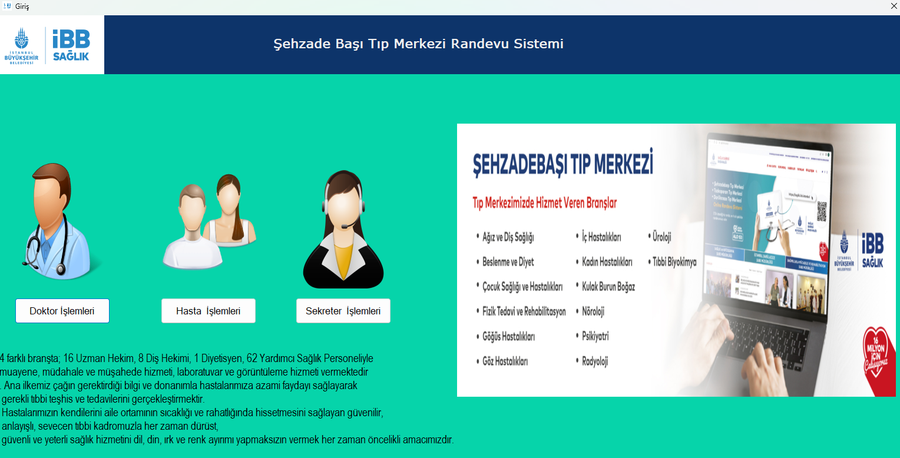
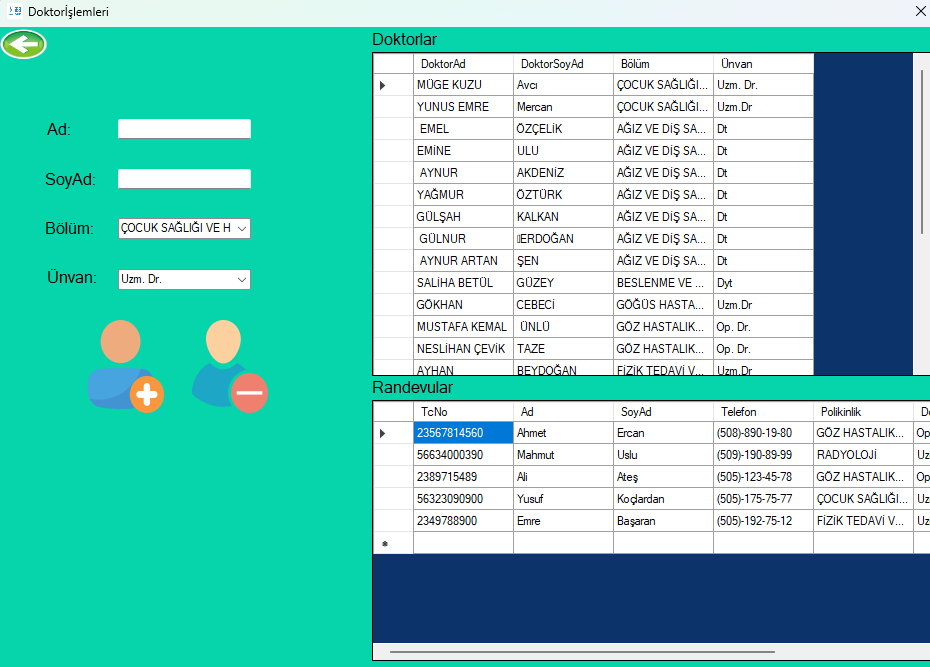
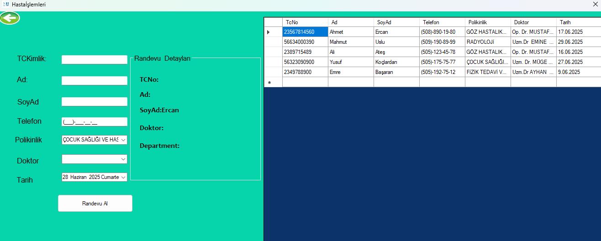
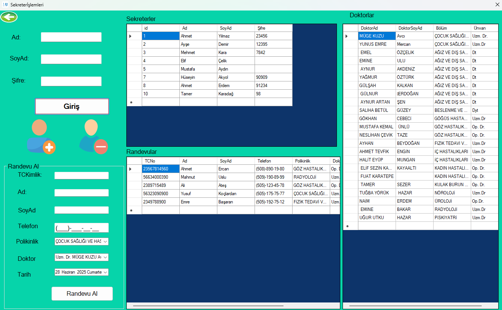

# 🏥 Hospital Management Panel / Hastane Yönetim Paneli

A desktop-based hospital management system built with **C# Windows Forms** and **SQL Server**, designed to manage patient appointments, doctor records, and secretary operations in a simple interface.

C# Windows Forms ve SQL Server kullanılarak geliştirilmiş masaüstü tabanlı bir **hastane yönetim sistemidir**. Sistem; hasta randevuları, doktor kayıtları ve sekreter işlemleri gibi yönetimsel işlevleri içerir.

---

## 📋 Features / Özellikler

### 👤 Patient Module / Hasta Modülü
- Appointment registration / Randevu alma
- View appointment details / Randevu detaylarını görüntüleme

### 🩺 Doctor Module / Doktor Modülü
- Add new doctors / Yeni doktor kaydı
- View doctor list / Doktorları listeleme
- View all appointments / Randevuları görüntüleme

### 👩‍💼 Secretary Module / Sekreter Modülü
- Secretary login / Sekreter girişi
- Add & delete secretary accounts / Sekreter kaydı ve silme
- View all doctors, patients, and appointments / Tüm doktorları, hastaları ve randevuları görüntüleme
- Create appointment (on behalf of patient) / Hasta adına randevu oluşturma

---

## 🛠️ Technologies Used / Kullanılan Teknolojiler

- **Programming Language / Programlama Dili:** C#
- **Framework:** .NET Framework (Windows Forms)
- **Database / Veritabanı:** SQL Server (MSSQL)
- **Development Environment / Geliştirme Ortamı:** Visual Studio

---

## 🖼️ Screenshots / Ekran Görüntüleri

### 🏠 Homepage

### 🧑‍⚕️ Doctor Operations

### 📅 Appointment Management

### 👩‍💼 Secretary Panel

---

## 🧑‍💻 Developer / Geliştirici

**Hüseyin Akyol**  
[GitHub Profilim](https://github.com/Huseyinnakyolll)

---

